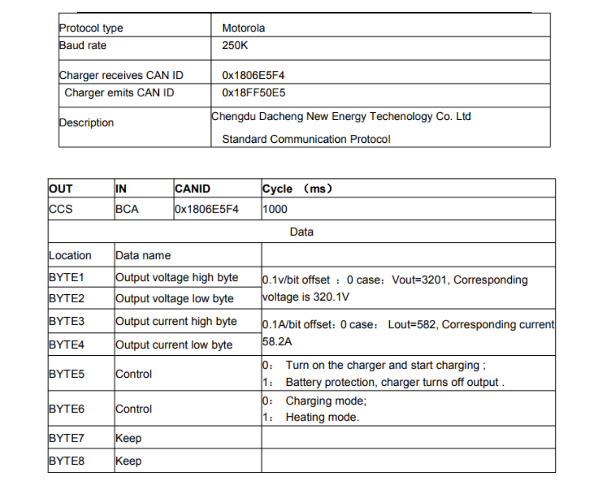

# CAN Bus Tutorial and Resources

This repository contains information and tutorials for working with the CAN bus using Arduino, along with a datasheet for a 3.3KW charger.

## Tutorials and Documentation

- [Arduino CAN Bus Tutorial](https://docs.arduino.cc/tutorials/uno-r4-minima/can)
- [GitHub Shield Library](https://seeeddoc.github.io/CAN-BUS_Shield/)
- [CAN Bus Shield Tutorial on Instructables](https://www.instructables.com/Seeed-Studio-CAN-BUS-V20-Hacking-Getting-Started/)

## Charger Datasheet

- [3.3KW Charger Overview](https://www.longrunobc.com/obc-q2-3-3kw-dc48-440v-10-42a-broad-voltage-with-can-stackable-smart-charger-product/)
- [3.3KW Charger Datasheet (PDF)](https://www.longrunobc.com/uploads/DCNE-Q2-3.3-6.6kw-charger-manual0510.pdf)

## CAN Bus Data Interpretation

When data is retrieved, it follows this HEX format:

ID, BIT1, BIT2, BIT3, BIT4, BIT5, BIT6, BIT7, BIT8

The ID typically represents a node within your vehicle. 

### Example: Air Conditioning Control
- **Node ID**: `0x402`
  - Turn OFF: `13`
  - Turn ON: `14`
  - Blower Low: `7C`
  - Blower Medium: `8C`
  - Blower High: `9C`

*Example*: Turning on Aircon to medium setting: 0x402, 13, 8C

### Other Nodes
- **Central Locking Node ID**: `0x503`
  - Lock All Doors: `14`

*Example*: Locking all doors: 0x502, 14

### Arduino Command Examples
- Engage Rear Locker: `CAN.sendMsgBuf(0x2B0, 0, 4, stmp);`
- Left Blinker On: `CAN.sendMsgBuf(0x2A8, 0, 6, stmp);`
- Right Blinker On: `CAN.sendMsgBuf(0x2A8, 0, 6, stmp);`
- ESP On/OFF: `CAN.sendMsgBuf(0x2B0, 0, 4, stmp);`

## Controlling the Charger Over CAN

- **Baud rate**: 250K
- **Charger Receives CAN ID**: `0x1806E5F4`
- **Charger Emits CAN ID**: `0x18FF50E5`

*Commands*:
- Start Charging: `CAN.sendMsgBuf(0x1806E5F4, 0, 0, stmp);`
- Alternative: `CAN.sendMsgBuf(0x1806E5F4, 0, 5, stmp);`

**Note**: Try reverse engineering the charger's CAN messages for effective control.

**Connection Tip**: Ensure a common ground between Arduino and the vehicle. Use OBD2 port pin 5 for signal ground or a chassis ground.

### Extra Resources 
[SparkFun CAN-Bus Arduino Library](https://github.com/sparkfun/SparkFun_CAN-Bus_Arduino_Library)
[CANbus Academy](https://learn.canbusacademy.com/)
[Ultimate Guide](img/CANguide.pdf)

